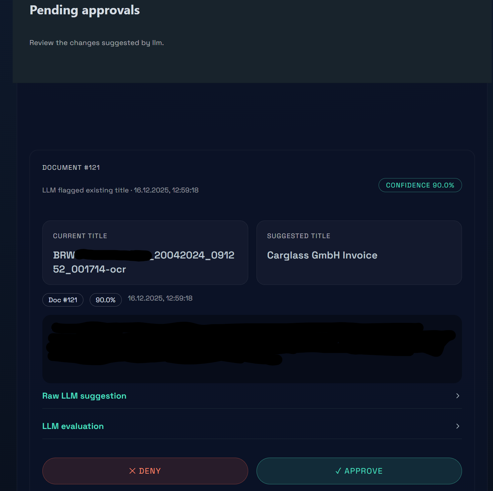

# Paperless AI Titles

Sidecar service that watches a Paperless-NGX instance, generates better document titles via an LLM, and updates Paperless through its REST API.



## Features
- Let AI suggest document titles based on document content
- Review suggestions manually or automatically apply new titles
- Store old titles in custom attribute
- Filter documents by tag (exlude or include documents with specific tag)

## Getting Started

### Prerequisites
- Docker and Docker Compose
- A Paperless-NGX instance with an API token that can read/write documents
- An OpenAI-compatible endpoint for title generation

### Where do I get an LLM from?
- Use OpenAI or any compatible API endpoint.
- To run locally, try `localai/localai:latest-aio-cpu`.
  - Use `docker-compose.localllm.yml` for a preconfigured setup.
  - Visit [http://localhost:8001](http://localhost:8001) to manage LocalAI.
  - Download a suitable model (for example `llama-3.2-3b-instruct:q8_0`, ~3.5 GB RAM, CPU-only).
  - (Optional) Set an API token.
  - Update `.env` with the model name and token (if set).

### Environment Variables
Copy `.env.example` to `.env` and tweak the defaults:

```bash
cp .env.example .env
```

Key groups (all editable later via the UI):
- `PAPERLESS_*`: Base URL, API token, include/skip/require tags, lock tag, optional webhook token, custom field slug for storing original titles.
- `LLM_*`: Endpoint, model name, token, confidence threshold, timeout for your local LLM proxy.
- `SCAN_*`, `QUEUE_*`: Scanner cadence, per-run enqueue cap, queue name, and retry/backoff settings.
- `SQLITE_PATH`, `REDIS_URL`: File/database locations for persistence and background jobs.

Environment variables provide safe defaults and pre-populate the UI for later tweaks.

### Run the stack

```bash
docker compose up --build
```

Services:
- `app`: FastAPI server + UI at `http://localhost:8080`
- `worker`: RQ worker consuming queued document jobs
- `redis`: Queue backend

### Setup & Paperless integration
1. Open `http://localhost:8080` after the stack starts. The setup screen loads your `.env` defaults, lets you test Paperless + LLM connections, lists recent documents, and offers a dry-run to inspect proposed titles.
2. Click **Start automation** to persist settings, mark onboarding complete, and start the background scanner.

